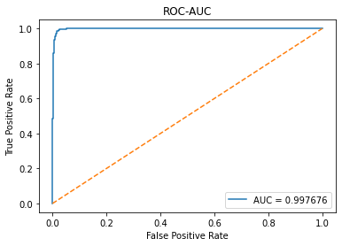
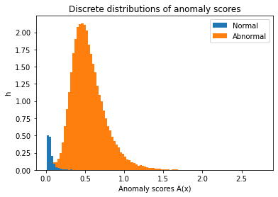
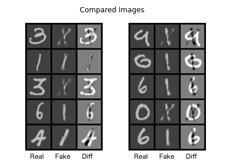

# f-AnoGAN

f-AnoGANは異常検知用のGANです。これは通常のGANの他に、画像から潜在空間へ写すEncoderを用いるもので、GANとEncoderについては別々に学習させます。異常検知についてはDiscriminatorの特徴量誤差と画像再構成誤差の2つからなる異常検出スコアに対して閾値を定めることで実現しています。

## References
論文

- [f-AnoGAN: Fast unsupervised anomaly detection with generative adversarial networks](https://www.sciencedirect.com/science/article/pii/S1361841518302640)

Github

- [tSchlegl/f-AnoGAN: Code for reproducing f-AnoGAN training and anomaly scoring](https://github.com/tSchlegl/f-AnoGAN)
- [PyTorch-GAN/wgan_gp.py at master · eriklindernoren/PyTorch-GAN](https://github.com/eriklindernoren/PyTorch-GAN/blob/master/implementations/wgan_gp/wgan_gp.py)
- [PyTorch-GAN/dcgan.py at master · eriklindernoren/PyTorch-GAN](https://github.com/eriklindernoren/PyTorch-GAN/blob/master/implementations/dcgan/dcgan.py)

このプロジェクト内の `mnist/model.py` 、 `fanogan/train_wgangp.py` と `fanogan/train_encoder_izif.py` は modified eriklindernoren の `wgan_gp.py` のコードを使っており、 `mvtec_ad/model.py` については modified eriklindernoren の `dcgan.py` のコードを使っています。

## 必要なパッケージ

Python 3.6 or later  
PyTorch 1.x

Matplotlib  
Numpy  
pandas  
Pillow  
scikit-learn

## データセットの学習とテスト方法

### MNIST

CPU環境において、以下のステップでコマンドを実行してください。

#### Step: 0

```
python setup.py install
cd mnist
```

#### Step: 1

```
python train_wgangp.py --training_label 1 --seed 2 --n_epochs 20
```

#### Step: 2

```
python train_encoder_izif.py --training_label 1 --seed 2 --n_epochs 20
```

#### Step: 3

```
python test_anomaly_detection.py --training_label 1
```

Step: 3 の後、ディレクトリ `results` の下に `score.csv` が生成されます。

 `score.csv` の可視化結果は [f-AnoGAN_MNIST.ipynb](https://colab.research.google.com/drive/1mnuMH2gZH5RR47haP9r8Rv568G1mjJ1T?usp=sharing) で確認することができます。

#### Step: 4

```
python save_compared_images.py --seed 4 --n_iters 0 --n_grid_lines 10
```

`f-AnoGAN/mnist/results/images_diff` の下に比較画像が保存されます。

#### 可視化結果






### 任意のデータセットの場合

以下のステップでコマンドを実行してください。

#### Step: 0

```
python setup.py install
cd your_own_dataset
```

`f-AnoGAN/your_own_dataset` の下に読み込みたいデータセットフォルダを置いてください。

#### Step: 1

`your_own_dataset_dir_name/train_dir_name` は自分のトレーニング用のデータセットのパスに置き換えて実行してください。

```
python train_wgangp.py "your_own_dataset_dir_name/train_dir_name"
```

#### Step: 2

`your_own_dataset_dir_name/train_dir_name` は自分のトレーニング用のデータセットのパスに置き換えて実行してください。

```
python train_encoder_izif.py "your_own_dataset_dir_name/train_dir_name"
```

#### Step: 3

`your_own_dataset_dir_name/test_dir_name` は自分のテスト用のデータセットのパスに置き換えて実行してください。

```
python test_anomaly_detection.py "your_own_dataset_dir_name/test_dir_name"
```

Step: 3 の後、ディレクトリ `results` の下に `score.csv` が生成されます。

#### Step: 4

`your_own_dataset_dir_name/test_dir_name` は自分のテスト用のデータセットのパスに置き換えて実行してください。

```
python save_compared_images.py "your_own_dataset_dir_name/test_dir_name" --n_iters 0 --n_grid_lines 10
```

`f-AnoGAN/your_own_dataset/results/images_diff` の下に比較画像が保存されます。

## Colaboratory

[f-AnoGAN_MNIST.ipynb](https://colab.research.google.com/drive/1mnuMH2gZH5RR47haP9r8Rv568G1mjJ1T?usp=sharing)  
[f-AnoGAN_MVTecAD.ipynb](https://colab.research.google.com/drive/1_mIcP6k-706O6Bo70iIAoEIhYGYO4wAe?usp=sharing)
