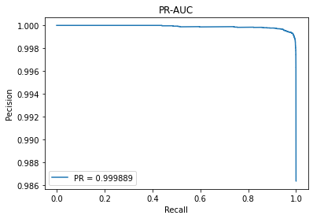

# f-AnoGAN

f-AnoGAN is a GAN for anomaly detection. One of the features of this GAN is that two adversarial networks (Generator and Discriminator) and Encoder are trained separately. In addition, an anomaly score is computed by both a discriminator feature residual error and an image reconstruction error.

## References
Papar

- [f-AnoGAN: Fast unsupervised anomaly detection with generative adversarial networks](https://www.sciencedirect.com/science/article/pii/S1361841518302640)

Github

- [tSchlegl/f-AnoGAN: Code for reproducing f-AnoGAN training and anomaly scoring](https://github.com/tSchlegl/f-AnoGAN)
- [PyTorch-GAN/wgan_gp.py at master · eriklindernoren/PyTorch-GAN](https://github.com/eriklindernoren/PyTorch-GAN/blob/master/implementations/wgan_gp/wgan_gp.py)
- [PyTorch-GAN/dcgan.py at master · eriklindernoren/PyTorch-GAN](https://github.com/eriklindernoren/PyTorch-GAN/blob/master/implementations/dcgan/dcgan.py)

`mnist/model.py`, `fanogan/train_wgangp.py` and `fanogan/train_encoder_izif.py` are modified eriklindernoren's `wgan_gp.py` for f-AnoGAN.  
`mvtec_ad/model.py` is modified eriklindernoren's `dcgan.py` for f-AnoGAN.

## Requirements

Python 3.6 or later  
PyTorch 1.x

Matplotlib  
Numpy  
pandas  
Pillow  
scikit-learn

## Usage for training and test a dataset

### MNIST

Please run below in order on the CPU.

#### Step: 0

```
python setup.py install
cd mnist
```

#### Step: 1

```
python train_wgangp.py --training_label 1 --seed 2 --n_epochs 20
```

#### Step: 2

```
python train_encoder_izif.py --training_label 1 --seed 2 --n_epochs 20
```

#### Step: 3

```
python test_anomaly_detection.py --training_label 1
```

After Step: 3, `score.csv` will be generated in the directory `results`.

See [f-AnoGAN_MNIST.ipynb](https://colab.research.google.com/drive/1mnuMH2gZH5RR47haP9r8Rv568G1mjJ1T?usp=sharing) about data visualization for `score.csv`.

#### Step: 4

```
python save_compared_images.py --seed 4 --n_iters 0 --n_grid_lines 10
```

Compared images are saved under `f-AnoGAN/mnist/results/images_diff`.

#### Visualization





### Your own dataset

Please run below in order.

#### Step: 0

```
python setup.py install
cd your_own_dataset
```

Add your own dataset under `f-AnoGAN/your_own_dataset`

#### Step: 1

Please replace `your_own_dataset_dir_name/train_dir_name` with a relative path of your own training data.

```
python train_wgangp.py "your_own_dataset_dir_name/train_dir_name"
```

#### Step: 2

Please replace `your_own_dataset_dir_name/train_dir_name` with a relative path of your own training data.

```
python train_encoder_izif.py "your_own_dataset_dir_name/train_dir_name"
```

#### Step: 3

Please replace `your_own_dataset_dir_name/test_dir_name` with a relative path of your own test data.

```
python test_anomaly_detection.py "your_own_dataset_dir_name/test_dir_name"
```

After Step: 3, `score.csv` will be generated in the directory `results`.

#### Step: 4

Please replace `your_own_dataset_dir_name/test_dir_name` with a relative path of your own test data.

```
python save_compared_images.py "your_own_dataset_dir_name/test_dir_name" --n_iters 0 --n_grid_lines 10
```

Compared images are saved under `f-AnoGAN/your_own_dataset/results/images_diff`.

## Colaboratory

[f-AnoGAN_MNIST.ipynb](https://colab.research.google.com/drive/1mnuMH2gZH5RR47haP9r8Rv568G1mjJ1T?usp=sharing)  
[f-AnoGAN_MVTecAD.ipynb](https://colab.research.google.com/drive/1_mIcP6k-706O6Bo70iIAoEIhYGYO4wAe?usp=sharing)
